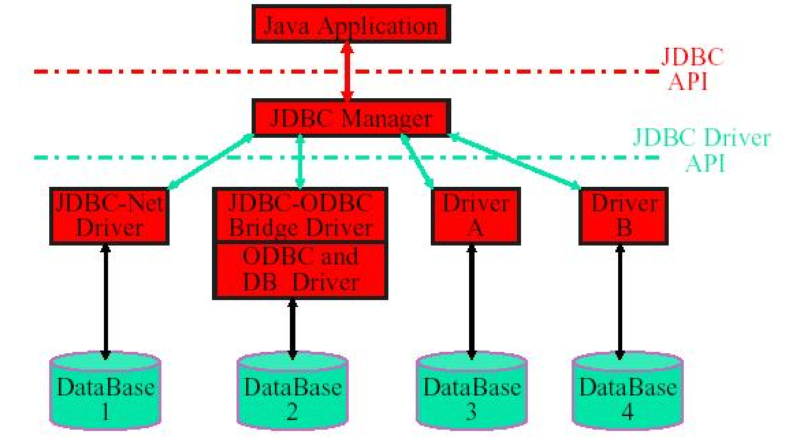
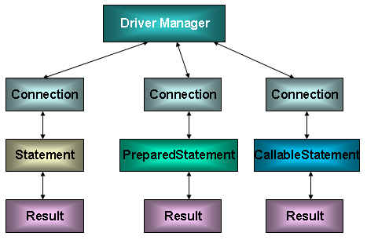
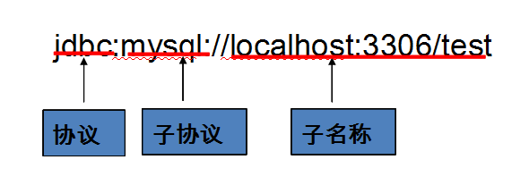
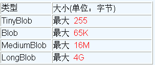
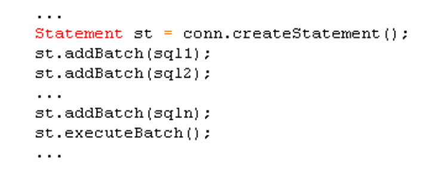
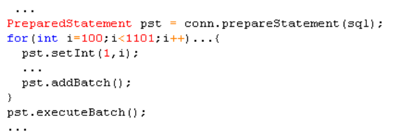
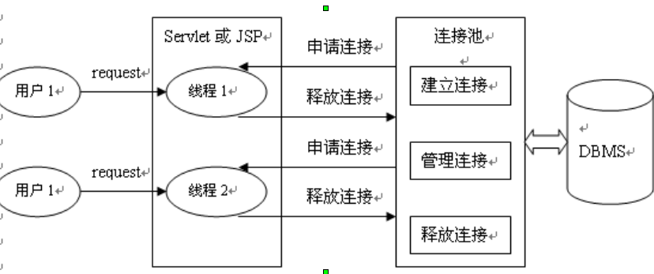
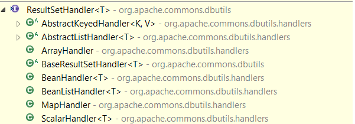
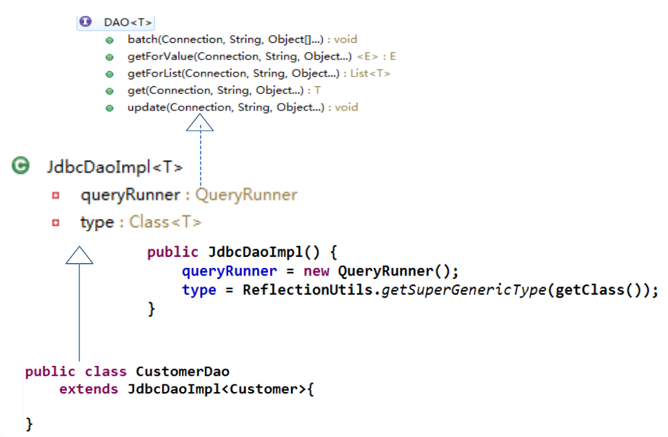

# JDBC Notes


### JDBC Architecture



### JDBC API



```java
/* Use Driver directly, should use DriverManager instead  */
Driver driver = (Driver) Class.forName(driverClass).newInstance();
Properties info = new Properties();
info.put("user", user);
info.put("password", password);

Connection connection = driver.connect(jdbcUrl, info);
```

### 加载与注册 JDBC 驱动

- 加载 JDBC 驱动需调用 Class 类的静态方法 forName()，向其传递要加载的 JDBC 驱动的类名
- 通常不用显式调用 DriverManager 类的 registerDriver() 方法来注册驱动程序类的实例
- 因为 Driver 接口的驱动程序类都包含了静态代码块，在这个静态代码块中，会调用 `DriverManager.registerDriver()`方法来注册自身的一个实例`org.postgresql.Driver`

```java
static
{
  try
  {
    // moved the registerDriver from the constructor to here
    // because some clients call the driver themselves (I know, as
    // my early jdbc work did - and that was based on other examples).
    // Placing it here, means that the driver is registered once only.
    java.sql.DriverManager.registerDriver(new Driver());
  }
  catch (SQLException e)
  {
      e.printStackTrace();
  }
}
```

### JDBC URL



```java
public static Connection getConnection() throws Exception {
  Properties properties = new Properties();
  InputStream inStream = JDBCTools.class.getClassLoader()
          .getResourceAsStream("jdbc.properties");
  properties.load(inStream);

  // 1. 准备获取连接的 4 个字符串: user, password, jdbcUrl, driverClass
  String user = properties.getProperty("user");
  String password = properties.getProperty("password");
  String jdbcUrl = properties.getProperty("jdbcUrl");
  String driverClass = properties.getProperty("driverClass");

  // 2. 加载驱动: Class.forName(driverClass)
  Class.forName(driverClass);

  // 3. 调用
  // DriverManager.getConnection(jdbcUrl, user, password)
  // 获取数据库连接
  Connection connection = DriverManager.getConnection(jdbcUrl, user,
          password);
  return connection;
}
```

### Statement

- 调用 `Connection` 对象的 `createStatement` 方法创建该对象
- 用于执行静态的 SQL 语句，并且返回执行结果
- Statement 接口中定义了下列方法用于执行 SQL 语句
  - `ResultSet excuteQuery(String sql)`
  - `int excuteUpdate(String sql)`
- `java.sql.Statement` 在一个给定的连接中作为 SQL 执行声明的容器，他包含了两个重要的子类型
  - `java.sql.PreparedSatement` 用于执行预编译的 sql 声明
  - `java.sql.CallableStatement` 用于执行数据库中存储过程的调用

### PreparedStatement

- 调用 `Connection` 对象的 `preparedStatement()` 方法获取 `PreparedStatement` 对象
- `PreparedStatement` 接口是 `Statement` 的子接口，它表示一条预编译过的 SQL 语句
- `PreparedStatement` 对象所代表的 SQL 语句中的参数用问号(?)来表示
- 调用 PreparedStatement 对象的 `setXXX()` 方法来设置这些参数
- 第一个参数是要设置的 SQL 语句中的参数的索引(从 1 开始)，第二个是设置的 SQL 语句中的参数的值

### PreparedStatement vs Statement

- 代码的可读性和可维护性
- `PreparedStatement` 能最大可能提高性能
- `PreparedStatement` 可以防止 SQL 注入

### DatabaseMetaData

- 通过`Connection`对象可以获得`DataBaseMetaData`
- `DataBaseMetaData` 的方法可以获得有关数据库管理系统的各种信息，包括数据库中的各个表，表中的各个列，数据类型，触发器，存储过程等各方面的信息.
- `getURL()`：返回一个`String`类对象，代表数据库的 URL
- `getUserName()`：返回连接当前数据库管理系统的用户名
- `getDatabaseProductName()`：返回数据库的产品名称
- `getDatabaseProductVersion()`：返回数据库的版本号
- `getDriverName()`：返回驱动驱动程序的名称

### ResultSet

- 调用 `Statement` 对象的 `excuteQuery()` 方法创建该对象
- `ResultSet` 对象以逻辑表格的形式封装了执行数据库操作的结果集，`ResultSet` 接口由数据库厂商实现
- `ResultSet` 对象维护了一个指向当前数据行的游标，初始的时候，游标在第一行之前，可以通过 `ResultSet` 对象的 `next()` 方法移动到下一行
- `ResultSet` 接口的常用方法
  - `boolean next()`
  - `getXXX()`

### ResultSetMetaData

- 可用于获取关于 `ResultSet` 对象中列的类型和属性信息的对象
- `getColumnName(int column)`：获取指定列的名称
- `getColumnCount()`：返回当前 `ResultSet` 对象中的列数
- `getColumnTypeName(int column)`：检索指定列的数据库特定的类型名称
- `isAutoIncrement(int column)`：指示是否自动为指定列进行编号，这样这些列仍然是只读的

### 取得数据库自动生成的主键

```java
String sql = "insert into user(name,password)
              values ('abc','123')";
PreparedStatement st = conn.prepareStatement(sql,Statement.RETURN_GENERATED_KEYS);
st.executeUpdate();
ResultSet rs = st.getGeneratedKeys();  //得到插入行的主键
if(rs.next())
    System.out.println(rs.getObject(1));
```

### Oracle LOB

- LOB，即 Large Objects（大对象），是用来存储大量的二进制和文本数据的一种数据类型（一个 LOB 字段可存储可多达 4GB 的数据)
- LOB 分为两种类型：内部 LOB 和外部 LOB
  - 内部 LOB 将数据以字节流的形式存储在数据库的内部。因而，内部 LOB 的许多操作都可以参与事务，也可以像处理普通数据一样对其进行备份和恢复操作
  - 目前只支持一种外部 LOB 类型 (Oracle)，即 BFILE 类型。在数据库内，该类型仅存储数据在操作系统中的位置信息，而数据的实体以外部文件的形式存在于操作系统的文件系统中。因而，该类型所表示的数据是只读的，不参与事务。该类型可帮助用户管理大量的由外部程序访问的文件。

### MySQL BLOB

- MySQL 中，BLOB 是一个二进制大型对象，是一个可以存储大量数据的容器，它能容纳不同大小的数据
- MySQL 的四种 BLOB 类型(除了在存储的最大信息量上不同外，他们是等同的)
  
- 实际使用中根据需要存入的数据大小定义不同的 BLOB 类型。 需要注意的是：如果存储的文件过大，数据库的性能会下降

### 数据库事务 (Transaction)

- 原子性（Atomicity)
- 一致性（Consistency)
- 隔离性（Isolation)
- 持久性（Durability)
- 为了让多个 SQL 语句作为一个事务执行
  - 调用 Connection 对象的 setAutoCommit(false) 以取消自动提交事务
  - 在所有的 SQL 语句都成功执行后，调用 commit() 方法提交事务
  - 在出现异常时，调用 rollback() 方法回滚事务
  - 若此时 Connection 没有被关闭, 则需要恢复其自动提交状态

### 数据库的隔离级别 (Isolation levels)

- 对于同时运行的多个事务, 当这些事务访问数据库中相同的数据时, 如果没有采取必要的隔离机制, 就会导致各种并发问题
  - 脏读: 对于两个事物 T1, T2, T1 读取了已经被 T2 更新但还没有被提交的字段. 之后, 若 T2 回滚, T1 读取的内容就是临时且无效的
  - 不可重复读: 对于两个事物 T1, T2, T1 读取了一个字段, 然后 T2 更新了该字段. 之后, T1 再次读取同一个字段, 值就不同了.
  - 幻读: 对于两个事物 T1, T2, T1 从一个表中读取了一个字段, 然后 T2 在该表中插入了一些新的行. 之后, 如果 T1 再次读取同一个表, 就会多出几行.
- 一个事务与其他事务隔离的程度称为隔离级别. 数据库规定了多种事务隔离级别, 不同隔离级别对应不同的干扰程度, 隔离级别越高, 数据一致性就越好, 但并发性越弱
- 数据库提供的 4 种事务隔离级别
  
- Oracle 支持的 2 种事务隔离级别：READ COMMITED, SERIALIZABLE. Oracle 默认的事务隔离级别为: READ COMMITED
- Mysql 支持 4 中事务隔离级别. Mysql 默认的事务隔离级别为: REPEATABLE READ

### 在 MySQL 中设置隔离级别

- 每启动一个 mysql 程序, 就会获得一个单独的数据库连接. 每个数据库连接都有一个全局变量 `@@tx_isolation`, 表示当前的事务隔离级别. MySQL 默认的隔离级别为 `Repeatable Read`
- 查看当前的隔离级别: `SELECT @@tx_isolation;`
- 设置当前 mySQL 连接的隔离级别: `set transaction isolation level read committed;`
- 设置数据库系统的全局的隔离级别: `set global transaction isolation level read committed;`

### 批量处理 JDBC 语句提高处理速度

- 当需要成批插入或者更新记录时。可以采用 Java 的批量更新机制，这一机制允许多条语句一次性提交给数据库批量处理。通常情况下比单独提交处理更有效率
- JDBC 的批量处理语句包括下面两个方法：
  - addBatch(String)：添加需要批量处理的 SQL 语句或是参数
  - executeBatch() 执行批量处理语句;
- 通常我们会遇到两种批量执行 SQL 语句的情况
  - 多条 SQL 语句的批量处理
    
  - 一个 SQL 语句的批量传参
    

### 数据库连接池 (connection pool)

- 数据库连接池在初始化时将创建一定数量的数据库连接放到连接池中，这些数据库连接的数量是由最小数据库连接数来设定的。无论这些数据库连接是否被使用，连接池都将一直保证至少拥有这么多的连接数量。连接池的最大数据库连接数量限定了这个连接池能占有的最大连接数，当应用程序向连接池请求的连接数超过最大连接数量时，这些请求将被加入到等待队列中
  
- `JDBC` 的数据库连接池使用 `javax.sql.DataSource` 来表示
- `DataSource` 只是一个接口，该接口通常由服务器(Weblogic, WebSphere, Tomcat)提供实现
- `DataSource` 通常被称为数据源，它包含连接池和连接池管理两个部分
- 常用数据库连接池
  - DBCP 数据库连接池
  - C3P0 数据库连接池
  - Druid (阿里巴巴, alibaba)

### DBCP 数据源

- 依赖该组织下的另一个开源系统：`Common-pool`
- 如需使用该连接池实现，应在系统中增加如下两个 jar 文件
  - `Commons-dbcp.jar`：连接池的实现
  - `Commons-pool.jar`：连接池实现的依赖库
- Tomcat 的连接池正是采用该连接池来实现的
- 数据源和数据库连接不同，数据源无需创建多个，它是产生数据库连接的工厂，因此整个应用只需要一个数据源即可

```java
/* 基本方法 */
BasicDataSource dataSource = new BasicDataSource();

dataSource.setUsername("docker");
dataSource.setPassword("docker");
dataSource.setUrl("jdbc:postgresql://192.168.56.56:5432/docker");
dataSource.setDriverClassName("org.postgresql.Driver");

Connection connection = dataSource.getConnection();
System.out.println(connection.getClass());

/* 使用工厂方法 */
Properties properties = new Properties();
InputStream inStream = JDBCTestV2.class.getClassLoader()
        .getResourceAsStream("dbcp.properties");
properties.load(inStream);
DataSource dataSource = BasicDataSourceFactory
        .createDataSource(properties);
System.out.println(dataSource.getConnection().getClass());

/* dbcp.properties */
username=docker
password=docker
driverClassName=org.postgresql.Driver
url=jdbc:postgresql://192.168.56.56:5432/docker
```

### C3P0 数据源

```java
ComboPooledDataSource ds = new ComboPooledDataSource();
ds.setDriverClass("org.postgresql.Driver");
ds.setUser("docker");
ds.setPassword("docker");
ds.setJdbcUrl("jdbc:postgresql://192.168.56.56:5432/docker");
ds.setInitialPoolSize(5);
ds.setMaxPoolSize(10);
ds.setMinPoolSize(5);

System.out.println(ds.getConnection());
```

### Apache—BeanUtils

```java
Object object = new Student();
BeanUtils.setProperty(object, "id", 1);
Object val = BeanUtils.getProperty(object, "id");
System.out.println(val);
```

### Apache—DBUtils

`commons-dbutils` 是 `Apache` 组织提供的一个开源`JDBC`工具类库，它是对`JDBC`的简单封装，学习成本极低，并且使用`dbutils`能极大简化`jdbc`编码的工作量，同时也不会影响程序的性能

- `org.apache.commons.dbutils.QueryRunner`
  - `QueryRunner`类提供了两个构造方法：
    - 默认的构造方法
    - 需要一个 `javax.sql.DataSource` 来作参数的构造方法
- `org.apache.commons.dbutils.ResultSetHandler`
  - 该接口用于处理 `java.sql.ResultSet`，将数据按要求转换为另一种形式
- `org.apache.commons.dbutils.DbUtils`

```java
Connection conn = JDBCToolsV2.getConnection();
String sql = "UPDATE student SET name = ? " +
        "WHERE id = ?";
QueryRunner queryRunner = new QueryRunner();
queryRunner.update(conn, sql, "anggao", 1);

/* ResultHandler 例子 */
String sql = "SELECT id, name FROM student";

QueryRunner queryRunner = new QueryRunner();
Object results = queryRunner.query(conn, sql, new ResultSetHandler<Object>(){

    @Override
    public Object handle(ResultSet resultSet) throws SQLException {
        List<Student> students = new ArrayList<Student>();
        while(resultSet.next()){
            Student stu = new Student();
            stu.setId(resultSet.getInt(1));
            stu.setStudentname(resultSet.getString(2));
            students.add(stu);
        }
        return students;
    }

});

System.out.println(results);
```



### DAO (data access object) 实现



