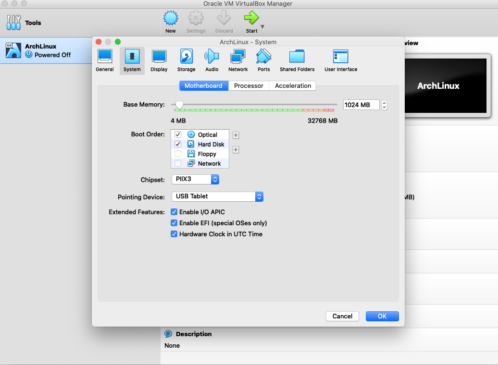

# Pre-installation

## Acquire an installation image
Arch is a “rolling release” distribution, download the `.iso` file from its [offical site](https://www.archlinux.org/download/).

## Create VM
Create a vm in virtualbox, make sure enable `EFI` in the motherboard. We will use use [UEFI](https://wiki.archlinux.org/index.php/Unified_Extensible_Firmware_Interface) instead of the older BIOS spec to boot the VM.



### Verify the boot mode

To verify the boot mode, list the [efivars](https://wiki.archlinux.org/index.php/Efivars) directory:

```bash
# ls /sys/firmware/efi/efivars
```

If the command shows the directory without error, then the system is booted in UEFI mode. 

## Partition the disks

We are going to use a simple partition scheme:

- an EFI system partition (ESP)
- one encrypted partition that holds our root filesystem
- a small partition for swap space

#### List storage device

````bash
# fdisk -l
````

Start the actual partitioning process, run `fdisk /dev/sda`

1. Create a GPT table by typing `g` (then hit enter).
2. Create your ESP by typing `n`.
3. Type `t` to change the type of the new partition (partition 1) to “EFI System”. 
4. Create your main root partition by typing `n` again. (This partition should already have the correct type, “Linux filesystem”)
5. Create your swap partition by typing `n` and just take all the defaults.
6. Type `t` to change the type of the swap partition (partition 3) to “Linux swap”
7. Type `p` to show the current partition table. You should see an “EFI System” partition, a “Linux filesystem” partition, and a “Linux swap” partition.
8. Type `w` to finally actually write the changes to disk.

## Create filesystems

#### ESP

The [ESP](https://wiki.archlinux.org/index.php/EFI_system_partition) (EFI System Partition) has to be in a FAT format. Find ESP partition `fdisk -l /dev/sda` it should be `sda1` `mkfs.fat -F32 /dev/sda1` to create the FAT32 filesystem.

#### Root partition

Root partition should be `/dev/sda2`, we are going to encrypt it. Details refer [Arch doc](https://wiki.archlinux.org/index.php/Dm-crypt/Encrypting_an_entire_system#LUKS_on_a_partition)

```bash
cryptsetup open --type plain -d /dev/urandom /dev/sda2 to_be_wiped
dd if=/dev/zero of=/dev/mapper/to_be_wiped status=progress bs=1M
cryptsetup close to_be_wiped
```

```bash
cryptsetup -y -v luksFormat /dev/sda2
```

Open the encrypted partition

```bash
cryptsetup open /dev/sda2 cryptroot
```

Use `lsblk` to see the hierarchy of these partitions, create the actual filesystem

```bash
mkfs.ext4 /dev/mapper/cryptroot
```

#### Swap

```bash
mkswap /dev/sda3
swapon /dev/sda3
```

## Mount the new filesystems

```bash
mount /dev/mapper/cryptroot /mnt
mkdir /mnt/boot
mount /dev/sda1 /mnt/boot
```

# Installation

For details check [arch wiki](https://wiki.archlinux.org/index.php/Installation_guide#Install_essential_packages)

### Install essential packages

```bash
pacstrap /mnt base linux linux-firmware
```

## Configure the system

### Fstab

Generate an [fstab](https://wiki.archlinux.org/index.php/Fstab) file (use `-U` or `-L` to define by [UUID](https://wiki.archlinux.org/index.php/UUID) or labels, respectively):

```bash
# genfstab -U /mnt >> /mnt/etc/fstab
```

### Chroot

```bash
# arch-chroot /mnt
```

`vim` is not installed in the chroot by default. You can do `pacman -S vim` to install it

### Time zone

```bash
# ln -sf /usr/share/zoneinfo/Region/City /etc/localtime
```

Run [hwclock(8)](https://jlk.fjfi.cvut.cz/arch/manpages/man/hwclock.8) to generate `/etc/adjtime`:

```
# hwclock --systohc
```

### Localization

Edit `/etc/locale.gen` and uncomment `en_US.UTF-8 UTF-8` and other needed [locales](https://wiki.archlinux.org/index.php/Locale). Generate the locales by running:

```bash
# locale-gen
```

### Network configuration

Create the [hostname](https://wiki.archlinux.org/index.php/Hostname) file:

```bash
vim /etc/hostname
myhostname
```

Add matching entries to [hosts(5)](https://jlk.fjfi.cvut.cz/arch/manpages/man/hosts.5):

```bash
vim /etc/hosts
127.0.0.1	localhost
::1		localhost
127.0.1.1	myhostname.localdomain	myhostname
```

### initramfs

On Arch, there’s a system to generate initramfs, need to make sure add disk encryption support.

```bash
vim /etc/mkinitcpio.conf
HOOKS=(base udev autodetect keyboard keymap modconf block encrypt filesystems fsck)
```

Run `mkinitcpio -p linux` to generate the new initramfs based on the new config file.

### Root password

```bash
passwd
```

### Boot loader

Historically, GRUB has been the only reasonable choice of boot loader. with the advent of UEFI, there are lots of different good options, we will use  [systemd-boot](https://wiki.archlinux.org/index.php/Systemd-boot).

#### install systemd-boot

```bash
bootctl --path=/boot install
```

#### Create a bootloader entry 

```bash
vim /boot/loader/entries/arch.conf

title   Arch Linux
linux   /vmlinuz-linux
initrd  /initramfs-linux.img
options cryptdevice=UUID=290d6a44-2964-48a0-a71e-ea3df0525987:cryptroot root=/dev/mapper/cryptroot rw
```

Make sure replace `290d6a44-2964-48a0-a71e-ea3df0525987` with the correct UUID for the encrypted `/dev/sda2` partition. 

```bash
ls -l /dev/disk/by-uuid
```

Type `exit` to exit the chroot and then type `reboot` 

That's all 🎉

