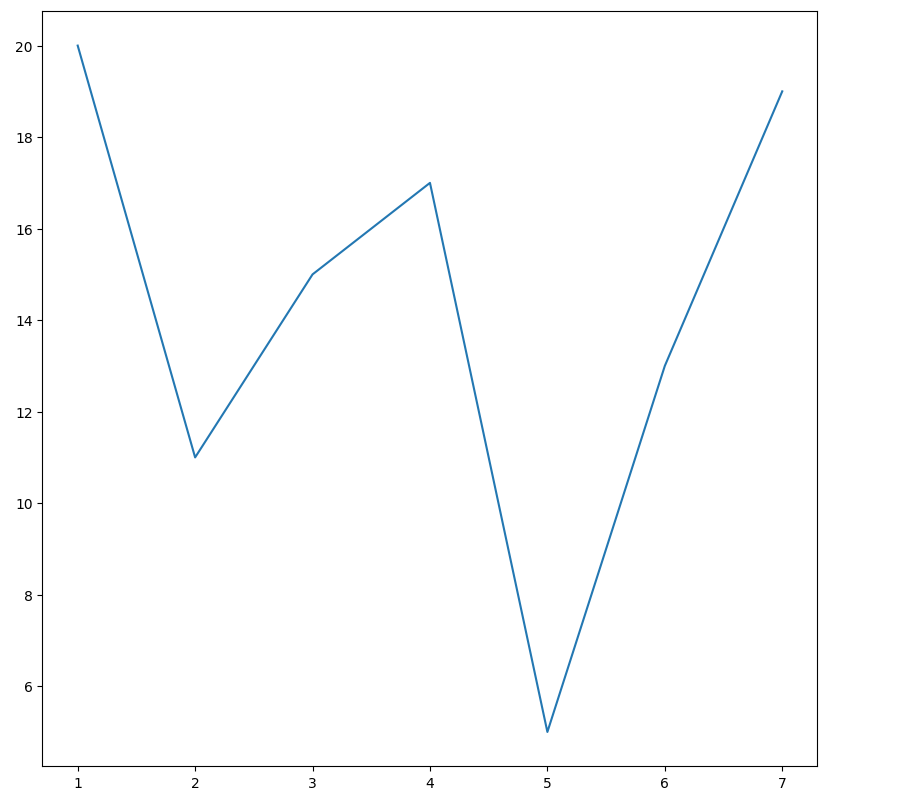
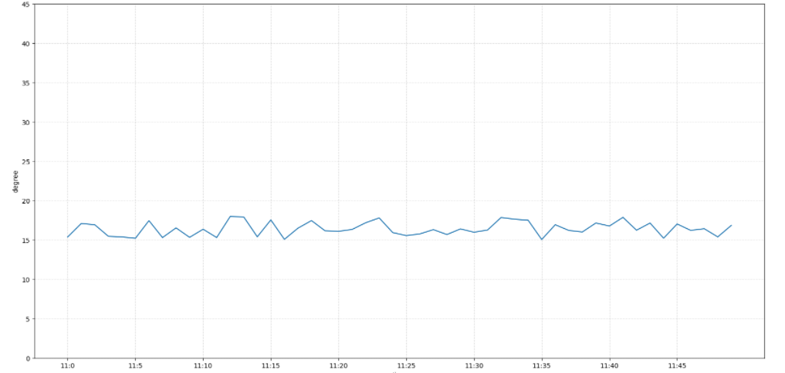
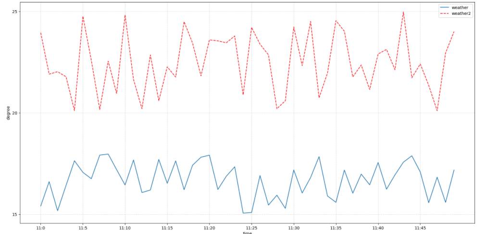
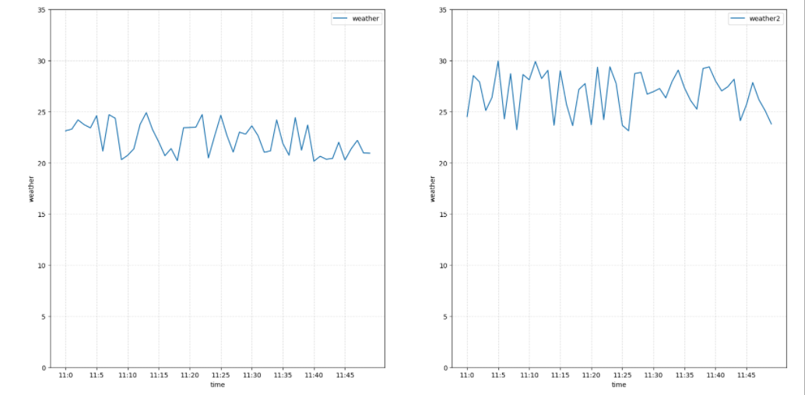
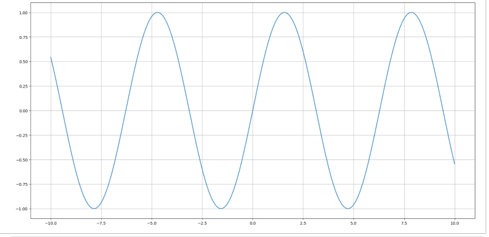
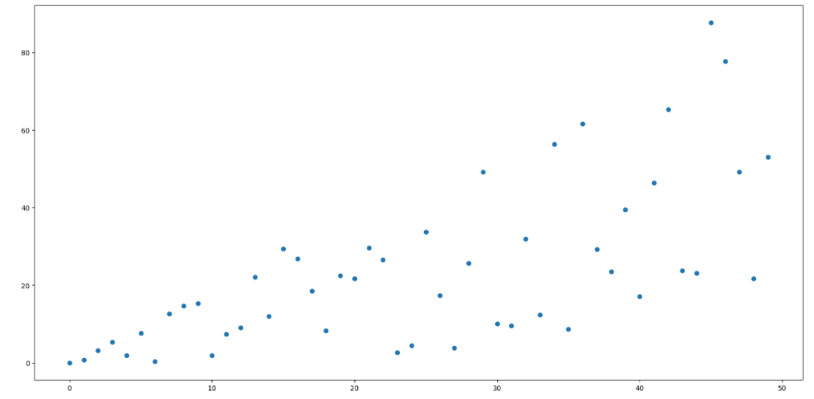

```python
import matplotlib.pyplot as plt
plt.figure(figsize=(10, 10), dpi=100)
plt.plot([1, 2, 3, 4, 5, 6 ,7], [17,17,18,15,11,11,13])
plt.show()
```



```python
import matplotlib.pyplot as plt
import random

x = range(50)
weather = [random.uniform(15, 18) for i in x]

plt.figure(figsize=(20, 10), dpi=100)
plt.plot(x, weather)


x_ticks_label = [f"11:{i}" for i in x]
y_ticks = range(50)
plt.xticks(x[::5], x_ticks_label[::5])
plt.yticks(y_ticks[::5])

plt.xlabel("time")
plt.ylabel("degree")


plt.grid(True, linestyle="--", alpha=0.5)

plt.savefig("test.png")

plt.show()
```



```python
import matplotlib.pyplot as plt
import random

x = range(50)
weather = [random.uniform(15, 18) for i in x]

plt.figure(figsize=(20, 10), dpi=100)
plt.plot(x, weather, label="weather")


x_ticks_label = [f"11:{i}" for i in x]
y_ticks = range(50)
plt.xticks(x[::5], x_ticks_label[::5])
plt.yticks(y_ticks[::5])

plt.xlabel("time")
plt.ylabel("degree")


plt.grid(True, linestyle="--", alpha=0.5)

weather2 = [random.uniform(20, 25) for i in x]
plt.plot(x, weather2, color="r", linestyle="--", label="weather2")
plt.legend(loc="best")

plt.show()
```



```python
import matplotlib.pyplot as plt
import random

x = range(50)
weather = [random.uniform(20, 25) for i in x]
weather2 = [random.uniform(23, 30) for i in x]

fig, axes = plt.subplots(nrows=1, ncols=2, figsize=(20, 10), dpi=100)

axes[0].plot(x, weather, label="weather")
axes[1].plot(x, weather2, label="weather2")

x_ticks_label = [f"11:{i}" for i in x]
y_ticks = range(40)

axes[0].set_xticks(x[::5])
axes[0].set_yticks(y_ticks[::5])
axes[0].set_xticklabels(x_ticks_label[::5])
axes[1].set_xticks(x[::5])
axes[1].set_yticks(y_ticks[::5])
axes[1].set_xticklabels(x_ticks_label[::5])

axes[0].grid(True, linestyle="--", alpha=0.5)
axes[1].grid(True, linestyle="--", alpha=0.5)

axes[0].set_xlabel("time")
axes[0].set_ylabel("weather")
axes[1].set_xlabel("time")
axes[1].set_ylabel("weather")

axes[0].legend(loc=0)
axes[1].legend(loc=0)

plt.show()
```



```python
import numpy as np
import matplotlib.pyplot as plt

x = np.linspace(-10, 10, 1000)
y = np.sin(x)

plt.figure(figsize=(20, 10), dpi=100)

plt.plot(x, y)

plt.grid()

plt.show()
```



```python
import matplotlib.pyplot as plt
import random
x = range(50)

y = [2 * i * random.random() for i in x]
        
plt.figure(figsize=(20, 10), dpi=100)

plt.scatter(x ,y)

plt.show()
```

